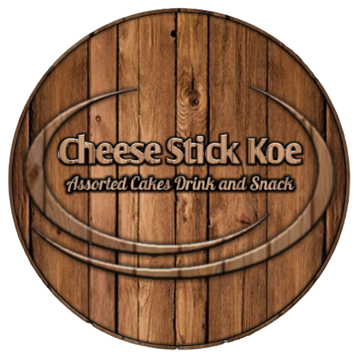

# 🧀 Cheese Stick Koe - Dashboard & Admin

<div align="center">
  
  <p><strong>Invoice Generator & Management System for Cheese Stick Koe</strong></p>

[](https://nextjs.org)
[](https://reactjs.org)
[](https://tailwindcss.com)
[](https://orm.drizzle.team)
[](https://supabase.com)

<hr />

[](https://www.react.doctor/share?p=invoice-generator&s=98&w=44&f=10)

</div>

---

## ✨ Features

- 📑 **Comprehensive Invoicing**: Create, manage, and track professional invoices with ease.
- 🧪 **Ingredient Master Data**: Track ingredients, units, and real-time price history.
- 📦 **Product Management**: Manage catalogs with complex size pricing and automated COGS calculation.
- 📊 **Dynamic Analytics**: Visualized client acquisition and revenue trends using Recharts.
- 📱 **Responsive Dashboard**: Fully interactive UI with Framer Motion and modern Tailwind v4 aesthetics.

## 🚀 Tech Stack

- **Framework**: [Next.js 16 (App Router)](https://nextjs.org/)
- **UI & Styling**: [React 19](https://react.dev/), [Tailwind CSS v4](https://tailwindcss.com/), [shadcn/ui](https://ui.shadcn.com/), [Framer Motion](https://www.framer.com/motion/)
- **Database & Auth**: [PostgreSQL (via Postgres)](https://www.postgresql.org/), [Drizzle ORM](https://orm.drizzle.team/), [Supabase](https://supabase.com/docs/guides/auth/ssr)
- **State & Forms**: [nuqs](https://nuqs.47ng.com/), [React Hook Form](https://react-hook-form.com/)
- **Visuals**: [Lucide React](https://lucide.dev/), [Recharts](https://recharts.org/)

## 🛠️ Development

### Getting Started

1. **Install dependencies**:

   ```bash
   npm install
   ```

2. **Database Setup**:

   ```bash
   npm run db:generate
   npm run db:push
   ```

3. **Run the development server**:
   ```bash
   npm run dev
   ```

### Scripts

- `npm run dev`: Start Next.js with Turbopack.
- `npm run build`: Production build.
- `npm run db:studio`: Open Drizzle Studio to visualize data.
- `npm run test:backend`: Run Vitest for backend logic.

---

## 🌐 Live Preview

Visit the production site: [cheesestick-koe.my.id](https://cheesestick-koe.my.id)

---

<div align="center">
  Built with ♥️ for the future of Cheese Stick Koe.
</div>

